# 影片高光編輯器

## 技術選型

### 核心框架與工具

| 技術     | 選擇       | 版本    | 理由                                                               |
| -------- | ---------- | ------- | ------------------------------------------------------------------ |
| 前端框架 | Vue 3      | ^3.5.0  | Composition API 更適合複雜狀態管理，與 Clean Architecture 理念契合 |
| 開發語言 | TypeScript | ^5.0.0  | 強型別確保代碼質量，降低 bug 率                                    |
| 構建工具 | Vite       | ^6.0.0  | 快速開發體驗，優秀的 HMR                                           |
| 狀態管理 | Pinia      | ^2.2.0  | Vue 3 官方推薦，簡潔的 API                                         |
| UI 框架  | Naive UI   | ^2.40.0 | TypeScript 友好，組件豐富，設計現代                                |
| 視頻處理 | video.js   | ^8.0.0  | 功能完整，跨瀏覽器兼容性好                                         |
| 樣式方案 | Tailwind   | v4      |                                                                    |

### Clean Architecture 四層架構

```
Infrastructure Layer          Presentation Layer
(技術基礎設施)                    (UI 展示層)
      ↓                             ↓
      └─────────→ Application Layer ←────────┘
                        ↓
                   Domain Layer
```

### Domain Layer（領域層）

#### 聚合根 Aggregate Roots

核心業務實體：

- Video
- Transcript
- Highlight

每個聚合根對應一個儲存庫介面。

#### 領域模型結構圖



**圖例說明：**

- 🔵 **藍色框**：聚合根（Aggregate Root），具有獨立的生命週期
- 🟠 **橙色框**：實體（Entity），屬於某個聚合，不能獨立存在
- 🟣 **紫色框**：值物件（Value Object），不可變，通過值比較相等性

**關鍵設計原則：**

1. **聚合邊界清晰**：Transcript 聚合包含 Section 和 Sentence，統一管理生命週期
2. **跨聚合引用使用 ID**：Highlight 通過 `videoId` 和 `sentenceIds` 引用，避免直接持有對象
3. **不可變性**：Transcript 的 sections 和 sentences 使用 `ReadonlyArray` 保護
4. **職責分離**：Sentence 不包含 `isSelected` 狀態，該狀態由 Highlight 管理

### Application Layer（應用層）

#### 用例 Use Cases

- UploadVideoUseCase (UploadVideoWithMockTranscriptUseCase)
  - 用於模擬上傳影片
- ProcessTranscriptUseCase
  - 用於模擬呼叫 AI API 處理並生成字幕與高光建議
- CreateHighlightUseCase
  - 建立高光剪輯（支援根據 AI 建議初始化選中句子）
- ToggleSentenceInHighlightUseCase
  - 切換句子在高光中的選中狀態
- RestoreSessionUseCase
  - 恢復使用者上次編輯的會話
- DeleteSessionUseCase
  - 刪除使用者的編輯會話

## 編輯區、預覽區同步功能

### 機制流程圖

```
  ┌─────────────────────────────────────────────────────────────┐
  │                      同步流程                               │
  └─────────────────────────────────────────────────────────────┘

  1⃣ 預覽區 → Store → 編輯區 (播放時同步高亮)
  ┌────────────────┐   timeupdate     ┌──────────────────┐
  │  VideoPlayer   │ ───────────────> │  PreviewArea     │
  │  (影片播放)    │                  │  (接收時間)      │
  └────────────────┘                  └──────────────────┘
                                              │
                           handleTimeUpdate() │ (100-105行)
                                              ↓
                                      ┌──────────────────┐
                                      │ transcriptStore. │
                                      │ setPlaying       │
                                      │ SentenceId()     │
                                      └──────────────────┘
                                              │
                          watch playingSentenceId (117行)
                                              ↓
                                      ┌──────────────────┐
                                      │  EditingArea     │
                                      │  (自動滾動)      │
                                      └──────────────────┘
                                              │
                                              ↓
                                      ┌──────────────────┐
                                      │  SentenceItem    │
                                      │  (高亮顯示)      │
                                      └──────────────────┘


  2⃣ 編輯區 → 預覽區 (點擊時間戳跳轉)
  ┌────────────────┐   點擊時間戳     ┌──────────────────┐
  │  SentenceItem  │ ───────────────> │  EditingArea     │
  │  (時間戳按鈕)  │                  │  (emit seekTime) │
  └────────────────┘                  └──────────────────┘
                                              │
                          watch seekTime prop │ (141-148行)
                                              ↓
                                      ┌──────────────────┐
                                      │  PreviewArea     │
                                      │  handleSeek()    │
                                      └──────────────────┘
                                              │
                                              ↓
                                      ┌──────────────────┐
                                      │  VideoPlayer     │
                                      │  seekTo()        │
                                      └──────────────────┘

```

---

🎯 關鍵設計模式

1. 單一數據源（Single Source of Truth）

// transcriptStore.ts
const playingSentenceId = ref<string | null>(null);

所有組件都監聽這個唯一的狀態，確保同步一致。

2. 事件驅動（Event-Driven）

- 預覽區 → 編輯區：通過 timeupdate 事件 + Store 更新
- 編輯區 → 預覽區：通過 prop + watch 機制

3. 響應式更新（Reactive Updates）

// 自動響應 playingSentenceId 變化
const playingSentenceId = computed(() => transcriptStore.playingSentenceId);

Vue 的響應式系統自動處理 UI 更新。

---

📊 同步效果

| 操作               | 結果                                             | 相關文件                                 |
| ------------------ | ------------------------------------------------ | ---------------------------------------- |
| 影片播放到某個句子 | 編輯區該句子高亮顯示並自動滾動到可視範圍         | PreviewArea.vue:100, EditingArea.vue:117 |
| 點擊編輯區的時間戳 | 影片跳轉到對應時間點並開始播放                   | PreviewArea.vue:141, VideoPlayer.vue:245 |
| 播放到非選中句子   | 編輯區清除高亮（因為 playingSentenceId 為 null） | PreviewArea.vue:103                      |

#### 測試資料

- 連結: [測試資料下載](https://drive.google.com/drive/folders/1upNRHKn654yqPgJ2WmgXzORgrYB7M_Lj?usp=share_link)
- 來源：[public test videos](https://gist.github.com/jsturgis/3b19447b304616f18657)
- 字幕：使用`whisper`產生
