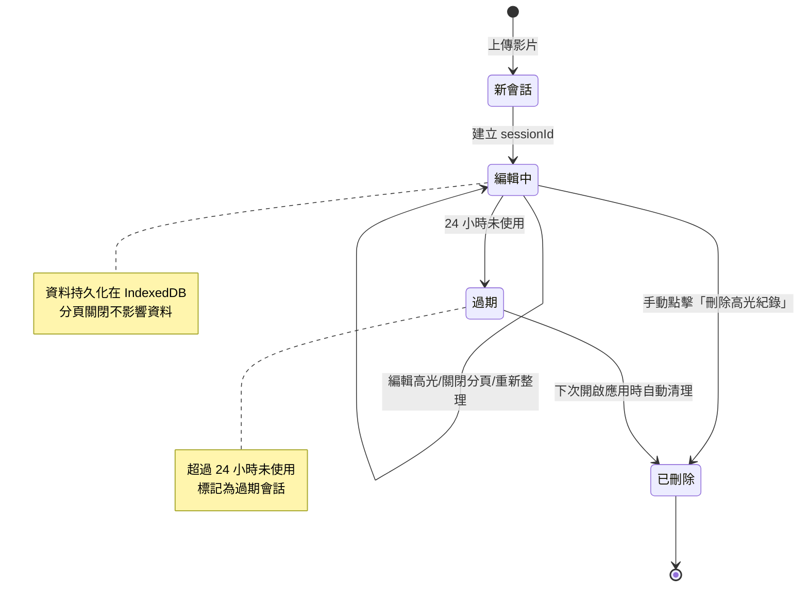

# 影片高光編輯器

- [部署連結](https://ychleo102615.github.io/video-highlight-tool/)
- [測試資料](#測試資料)

## 📋 文件大綱

- [技術選型](#技術選型) - 核心框架與工具選擇
- [Clean Architecture 四層架構](#clean-architecture-四層架構) - 架構設計原則
  - [Domain Layer（領域層）](#domain-layer領域層) - 核心業務實體與聚合根
  - [Application Layer（應用層）](#application-layer應用層) - 用例與業務流程
- [Key Features](#key-features-api-設計)
  - [API 設計](#key-features-api-設計) - 轉錄資料結構
  - [編輯區、預覽區同步](#key-features-編輯區預覽區同步功能) - 雙向同步機制
  - UI 相關 Key Features 請見實際畫面
  - [Out of Scope: 持久化設計](#custom-key-feature持久化設計) - 會話資料管理與自動清理
- [Follow Up](#follow-up) - 後續開發計畫
- [測試資料](#測試資料) - 開發用測試影片

---

## 技術選型

### 核心框架與工具

| 技術     | 選擇       | 版本    | 理由                                                               |
| -------- | ---------- | ------- | ------------------------------------------------------------------ |
| 前端框架 | Vue 3      | ^3.5.0  | Composition API 更適合複雜狀態管理，與 Clean Architecture 理念契合 |
| 開發語言 | TypeScript | ^5.0.0  | 強型別確保代碼質量，降低 bug 率                                    |
| 構建工具 | Vite       | ^6.0.0  | 快速開發體驗，優秀的 HMR                                           |
| 狀態管理 | Pinia      | ^2.2.0  | Vue 3 官方推薦，簡潔的 API                                         |
| UI 框架  | Naive UI   | ^2.40.0 | TypeScript 友好，組件豐富，設計現代                                |
| 視頻處理 | video.js   | ^8.0.0  | 功能完整，跨瀏覽器兼容性好                                         |
| 樣式方案 | Tailwind   | ^4.1.16 | 新 Oxide 引擎編譯速度快、零配置、原生 CSS 支援、包體積更小         |

### Clean Architecture 四層架構

```
Infrastructure Layer          Presentation Layer
(技術基礎設施)                    (UI 展示層)
      ↓                             ↓
      └─────────→ Application Layer ←────────┘
                        ↓
                   Domain Layer
```

### Domain Layer（領域層）

#### 聚合根 Aggregate Roots

核心業務實體：

- Video
- Transcript
- Highlight

每個聚合根對應一個儲存庫介面。

#### 領域模型結構圖



**圖例說明：**

- 🔵 **藍色框**：聚合根（Aggregate Root），具有獨立的生命週期
- 🟠 **橙色框**：實體（Entity），屬於某個聚合，不能獨立存在
- 🟣 **紫色框**：值物件（Value Object），不可變，通過值比較相等性

**關鍵設計原則：**

1. **聚合邊界清晰**：Transcript 聚合包含 Section 和 Sentence，統一管理生命週期
2. **跨聚合引用使用 ID**：Highlight 通過 `videoId` 和 `sentenceIds` 引用，避免直接持有對象
3. **不可變性**：Transcript 的 sections 和 sentences 使用 `ReadonlyArray` 保護
4. **職責分離**：Sentence 不包含 `isSelected` 狀態，該狀態由 Highlight 管理

### Application Layer（應用層）

#### 用例 Use Cases

- UploadVideoUseCase (UploadVideoWithMockTranscriptUseCase)
  - 用於模擬上傳影片（以及假 API 回覆檔案）
- ProcessTranscriptUseCase
  - 用於模擬呼叫 AI API 處理並生成字幕與高光建議
- CreateHighlightUseCase
  - 建立高光剪輯（支援根據 AI 建議初始化選中句子）
- ToggleSentenceInHighlightUseCase
  - 切換句子在高光中的選中狀態
- RestoreSessionUseCase
  - 恢復使用者上次編輯的會話
- DeleteSessionUseCase
  - 刪除使用者的編輯會話

## Key Features: API 設計

```json
{
  "fullText": "完整轉錄文字內容...",
  "sections": [
    {
      "id": "section-001",
      "title": "開場介紹",
      "sentences": [
        {
          "id": "sentence-001",
          "text": "大家好，歡迎來到今天的分享。",
          "startTime": 0.0,
          "endTime": 3.5,
          "isHighlightSuggestion": true
        },
        {
          "id": "sentence-002",
          "text": "今天我們要討論前端架構設計。",
          "startTime": 3.5,
          "endTime": 7.2,
          "isHighlightSuggestion": false
        }
      ]
    },
    {
      "id": "section-002",
      "title": "主題討論",
      "sentences": [
        {
          "id": "sentence-003",
          "text": "Clean Architecture 是重要的設計模式。",
          "startTime": 7.2,
          "endTime": 11.5,
          "isHighlightSuggestion": true
        }
      ]
    }
  ]
}
```

## Key Features: 編輯區、預覽區同步功能

### 機制流程圖

```
  ┌─────────────────────────────────────────────────────────────┐
  │                      同步流程                               │
  └─────────────────────────────────────────────────────────────┘

  1⃣ 預覽區 → Store → 編輯區 (播放時同步高亮)
  ┌────────────────┐   timeupdate     ┌──────────────────┐
  │  VideoPlayer   │ ───────────────> │  PreviewArea     │
  │  (影片播放)    │                  │  (接收時間)      │
  └────────────────┘                  └──────────────────┘
                                              │
                           handleTimeUpdate() │ (100-105行)
                                              ↓
                                      ┌──────────────────┐
                                      │ transcriptStore. │
                                      │ setPlaying       │
                                      │ SentenceId()     │
                                      └──────────────────┘
                                              │
                          watch playingSentenceId (117行)
                                              ↓
                                      ┌──────────────────┐
                                      │  EditingArea     │
                                      │  (自動滾動)      │
                                      └──────────────────┘
                                              │
                                              ↓
                                      ┌──────────────────┐
                                      │  SentenceItem    │
                                      │  (高亮顯示)      │
                                      └──────────────────┘


  2⃣ 編輯區 → 預覽區 (點擊時間戳跳轉)
  ┌────────────────┐   點擊時間戳     ┌──────────────────┐
  │  SentenceItem  │ ───────────────> │  EditingArea     │
  │  (時間戳按鈕)  │                  │  (emit seekTime) │
  └────────────────┘                  └──────────────────┘
                                              │
                          watch seekTime prop │ (141-148行)
                                              ↓
                                      ┌──────────────────┐
                                      │  PreviewArea     │
                                      │  handleSeek()    │
                                      └──────────────────┘
                                              │
                                              ↓
                                      ┌──────────────────┐
                                      │  VideoPlayer     │
                                      │  seekTo()        │
                                      └──────────────────┘

```

🎯 關鍵設計模式

1. 單一數據源（Single Source of Truth）

// transcriptStore.ts
const playingSentenceId = ref<string | null>(null);

所有組件都監聽這個唯一的狀態，確保同步一致。

2. 事件驅動（Event-Driven）

- 預覽區 → 編輯區：通過 timeupdate 事件 + Store 更新
- 編輯區 → 預覽區：通過 prop + watch 機制

3. 響應式更新（Reactive Updates）

// 自動響應 playingSentenceId 變化
const playingSentenceId = computed(() => transcriptStore.playingSentenceId);

Vue 的響應式系統自動處理 UI 更新。

| 操作               | 結果                                             | 相關文件                                 |
| ------------------ | ------------------------------------------------ | ---------------------------------------- |
| 影片播放到某個句子 | 編輯區該句子高亮顯示並自動滾動到可視範圍         | PreviewArea.vue:100, EditingArea.vue:117 |
| 點擊編輯區的時間戳 | 影片跳轉到對應時間點並開始播放                   | PreviewArea.vue:141, VideoPlayer.vue:245 |
| 播放到非選中句子   | 編輯區清除高亮（因為 playingSentenceId 為 null） | PreviewArea.vue:103                      |

## Custom Key Feature：持久化設計

### 會話資料持久化機制

本應用採用 **瀏覽器本地儲存** 方案，確保使用者的編輯資料不會因為分頁關閉或重新整理而遺失。

#### 儲存架構

```
┌─────────────────────────────────────────────────────────┐
│                    瀏覽器儲存層                         │
├─────────────────────────────────────────────────────────┤
│                                                         │
│  SessionStorage                    IndexedDB            │
│  ┌──────────────┐                 ┌─────────────────┐   │
│  │  sessionId   │────關聯────────►│  Videos         │   │
│  │  (UUID)      │                 │  Transcripts    │   │
│  └──────────────┘                 │  Highlights     │   │
│       ↑                           │  SessionMeta    │   │
│       │                           └─────────────────┘   │
│  分頁獨立識別                     跨分頁資料庫          │
└─────────────────────────────────────────────────────────┘
```

#### 資料生命週期



#### 關鍵特性

**1. 分頁隔離**

- 每個瀏覽器分頁擁有獨立的 `sessionId`（儲存於 SessionStorage）
- 不同分頁的編輯互不干擾，可同時進行多個專案

**2. 資料持久化**

- 使用 **IndexedDB** 儲存大型資料（視頻檔案、轉錄內容、高光設定）
- 分頁關閉或重新整理不會遺失資料
- 下次開啟時自動恢復上次的編輯進度

**3. 手動刪除機制**

- 應用程式 Header 提供「刪除高光紀錄」按鈕
- 點擊後顯示確認對話框，列出將刪除的資料範圍
- 確認後刪除當前 sessionId 的所有資料：
  - IndexedDB 中的 videos/transcripts/highlights
  - SessionStorage 中的 sessionId
  - Pinia stores 狀態重置

**4. 自動清理機制**

- 系統在應用啟動時檢查所有會話的 `savedAt` 時間戳
- 自動清理超過 **24 小時** 未使用的會話資料
- 避免佔用過多瀏覽器儲存空間

#### Use Case：DeleteSessionUseCase

負責處理會話刪除邏輯：

```typescript
// 簡化示意
class DeleteSessionUseCase {
  async execute(sessionId: string): Promise<void> {
    // 1. 從 IndexedDB 刪除該 sessionId 的所有資料
    await videoRepository.deleteBySessionId(sessionId);
    await transcriptRepository.deleteBySessionId(sessionId);
    await highlightRepository.deleteBySessionId(sessionId);

    // 2. 清除 SessionStorage
    sessionStorage.removeItem('sessionId');

    // 3. 重置應用狀態
    resetStores();
  }
}
```

#### 使用者介面提示

刪除按鈕旁顯示說明文字：

> 💡 **系統會在應用啟動時自動清理超過 24 小時的會話資料**

確保使用者了解資料生命週期，避免誤解資料遺失。

## Follow Up

- 編輯狀態輸出功能
- 高光片段依序預覽功能
- 串接真實 API
- 輸出剪輯片段功能（額外 API 或是本地實作）

---

#### 測試資料

- 連結: [測試資料下載](https://drive.google.com/drive/folders/1upNRHKn654yqPgJ2WmgXzORgrYB7M_Lj?usp=share_link)
- 來源：[public test videos](https://gist.github.com/jsturgis/3b19447b304616f18657)
- 字幕：使用`whisper`產生
