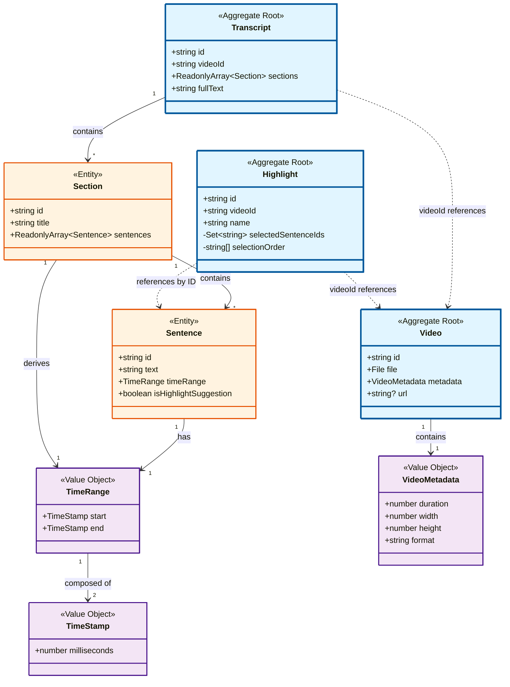
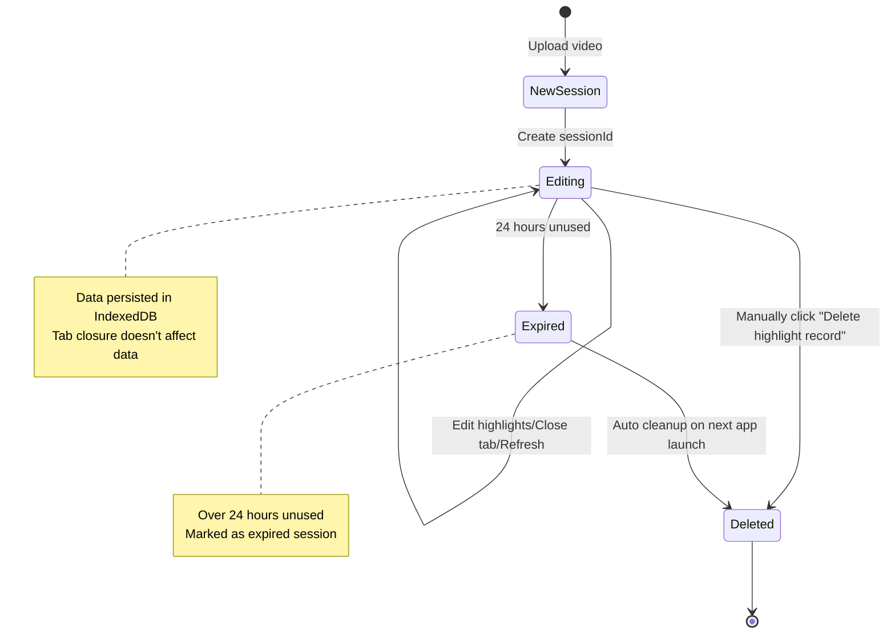

# Video Highlight Editor

- [Live Demo](https://ychleo102615.github.io/video-highlight-tool/)
- [Test Data](#test-data)

## 📋 Documentation Outline

- [Technology Stack](#technology-stack) - Core framework and tooling choices
- [Clean Architecture Four-Layer Structure](#clean-architecture-four-layer-structure) - Architecture design principles
  - [Domain Layer](#domain-layer) - Core business entities and aggregate roots
  - [Application Layer](#application-layer) - Use cases and business workflows
- [Key Features](#key-features-api-design)
  - [API Design](#key-features-api-design) - Transcription data structure
  - [Editing Area & Preview Area Synchronization](#key-features-editing-area-and-preview-area-synchronization) - Bidirectional sync mechanism
  - UI-related Key Features - See actual interface
  - [Out of Scope: Persistence Design](#custom-key-feature-persistence-design) - Session data management and automatic cleanup
- [Follow Up](#follow-up) - Future development plans
- [Test Data](#test-data) - Development test videos

---

## Technology Stack

### Core Framework and Tools

| Technology       | Choice     | Version | Rationale                                                                     |
| ---------------- | ---------- | ------- | ----------------------------------------------------------------------------- |
| Frontend Framework | Vue 3      | ^3.5.0  | Composition API better suited for complex state management, aligns with Clean Architecture |
| Development Language | TypeScript | ^5.0.0  | Strong typing ensures code quality, reduces bug rate                          |
| Build Tool       | Vite       | ^6.0.0  | Fast development experience, excellent HMR                                    |
| State Management | Pinia      | ^2.2.0  | Vue 3 official recommendation, clean API                                      |
| UI Framework     | Naive UI   | ^2.40.0 | TypeScript-friendly, rich components, modern design                           |
| Video Processing | video.js   | ^8.0.0  | Feature-complete, excellent cross-browser compatibility                       |
| Styling Solution | Tailwind   | ^4.1.16 | New Oxide engine with faster compilation, zero-config, native CSS support, smaller bundle |

### Clean Architecture Four-Layer Structure

```
Infrastructure Layer          Presentation Layer
(Technical Infrastructure)         (UI Layer)
      ↓                             ↓
      └─────────→ Application Layer ←────────┘
                        ↓
                   Domain Layer
```

### Domain Layer

#### Aggregate Roots

Core business entities:

- Video
- Transcript
- Highlight

Each aggregate root corresponds to a repository interface.

#### Domain Model Structure Diagram



**Legend:**

- 🔵 **Blue Box**: Aggregate Root - has independent lifecycle
- 🟠 **Orange Box**: Entity - belongs to an aggregate, cannot exist independently
- 🟣 **Purple Box**: Value Object - immutable, equality by value

**Key Design Principles:**

1. **Clear Aggregate Boundaries**: Transcript aggregate contains Section and Sentence, managing lifecycle uniformly
2. **Cross-Aggregate References Use IDs**: Highlight references via `videoId` and `sentenceIds`, avoiding direct object holding
3. **Immutability**: Transcript's sections and sentences use `ReadonlyArray` for protection
4. **Separation of Concerns**: Sentence doesn't contain `isSelected` state, which is managed by Highlight

### Application Layer

#### Use Cases

- UploadVideoUseCase (UploadVideoWithMockTranscriptUseCase)
  - Simulate video upload (and mock API response file)
- ProcessTranscriptUseCase
  - Simulate calling AI API to process and generate subtitles and highlight suggestions
- CreateHighlightUseCase
  - Create highlight clip (supports initialization of selected sentences based on AI suggestions)
- ToggleSentenceInHighlightUseCase
  - Toggle sentence selection state in highlight
- RestoreSessionUseCase
  - Restore user's last editing session
- DeleteSessionUseCase
  - Delete user's editing session

## Key Features: API Design

```json
{
  "fullText": "Full transcription text content...",
  "sections": [
    {
      "id": "section-001",
      "title": "Opening Introduction",
      "sentences": [
        {
          "id": "sentence-001",
          "text": "Hello everyone, welcome to today's sharing.",
          "startTime": 0.0,
          "endTime": 3.5,
          "isHighlightSuggestion": true
        },
        {
          "id": "sentence-002",
          "text": "Today we'll discuss frontend architecture design.",
          "startTime": 3.5,
          "endTime": 7.2,
          "isHighlightSuggestion": false
        }
      ]
    },
    {
      "id": "section-002",
      "title": "Topic Discussion",
      "sentences": [
        {
          "id": "sentence-003",
          "text": "Clean Architecture is an important design pattern.",
          "startTime": 7.2,
          "endTime": 11.5,
          "isHighlightSuggestion": true
        }
      ]
    }
  ]
}
```

## Key Features: Editing Area and Preview Area Synchronization

### Mechanism Flow Diagram

```
  ┌─────────────────────────────────────────────────────────────┐
  │                    Synchronization Flow                      │
  └─────────────────────────────────────────────────────────────┘

  1⃣ Preview Area → Store → Editing Area (Highlight during playback)
  ┌────────────────┐   timeupdate     ┌──────────────────┐
  │  VideoPlayer   │ ───────────────> │  PreviewArea     │
  │  (Video Play)  │                  │  (Receive time)  │
  └────────────────┘                  └──────────────────┘
                                              │
                           handleTimeUpdate() │ (lines 100-105)
                                              ↓
                                      ┌──────────────────┐
                                      │ transcriptStore. │
                                      │ setPlaying       │
                                      │ SentenceId()     │
                                      └──────────────────┘
                                              │
                          watch playingSentenceId (line 117)
                                              ↓
                                      ┌──────────────────┐
                                      │  EditingArea     │
                                      │  (Auto-scroll)   │
                                      └──────────────────┘
                                              │
                                              ↓
                                      ┌──────────────────┐
                                      │  SentenceItem    │
                                      │  (Highlight)     │
                                      └──────────────────┘


  2⃣ Editing Area → Preview Area (Click timestamp to seek)
  ┌────────────────┐   Click timestamp ┌──────────────────┐
  │  SentenceItem  │ ───────────────> │  EditingArea     │
  │  (Timestamp)   │                  │  (emit seekTime) │
  └────────────────┘                  └──────────────────┘
                                              │
                          watch seekTime prop │ (lines 141-148)
                                              ↓
                                      ┌──────────────────┐
                                      │  PreviewArea     │
                                      │  handleSeek()    │
                                      └──────────────────┘
                                              │
                                              ↓
                                      ┌──────────────────┐
                                      │  VideoPlayer     │
                                      │  seekTo()        │
                                      └──────────────────┘

```

🎯 Key Design Patterns

1. Single Source of Truth

```typescript
// transcriptStore.ts
const playingSentenceId = ref<string | null>(null);
```

All components watch this single state to ensure synchronization consistency.

2. Event-Driven

- Preview Area → Editing Area: via timeupdate event + Store update
- Editing Area → Preview Area: via prop + watch mechanism

3. Reactive Updates

```typescript
// Automatically responds to playingSentenceId changes
const playingSentenceId = computed(() => transcriptStore.playingSentenceId);
```

Vue's reactivity system automatically handles UI updates.

| Operation               | Result                                                          | Related Files                            |
| ----------------------- | --------------------------------------------------------------- | ---------------------------------------- |
| Video plays to sentence | Editing area highlights sentence and auto-scrolls into view     | PreviewArea.vue:100, EditingArea.vue:117 |
| Click timestamp in editing area | Video seeks to corresponding time and starts playing       | PreviewArea.vue:141, VideoPlayer.vue:245 |
| Play to unselected sentence | Editing area clears highlight (because playingSentenceId is null) | PreviewArea.vue:103                      |

## Custom Key Feature: Persistence Design

### Session Data Persistence Mechanism

This application adopts a **browser local storage** solution to ensure user editing data is not lost due to tab closure or refresh.

#### Storage Architecture

```
┌─────────────────────────────────────────────────────────┐
│                    Browser Storage Layer                │
├─────────────────────────────────────────────────────────┤
│                                                         │
│  SessionStorage                    IndexedDB            │
│  ┌──────────────┐                 ┌─────────────────┐   │
│  │  sessionId   │────Associated───►│  Videos         │   │
│  │  (UUID)      │                 │  Transcripts    │   │
│  └──────────────┘                 │  Highlights     │   │
│       ↑                           │  SessionMeta    │   │
│       │                           └─────────────────┘   │
│  Tab-specific ID                  Cross-tab database    │
└─────────────────────────────────────────────────────────┘
```

#### Data Lifecycle



#### Key Features

**1. Tab Isolation**

- Each browser tab has an independent `sessionId` (stored in SessionStorage)
- Edits in different tabs don't interfere, multiple projects can run simultaneously

**2. Data Persistence**

- Uses **IndexedDB** to store large data (video files, transcription content, highlight settings)
- Data is not lost when tabs are closed or refreshed
- Automatically restores last editing progress on next launch

**3. Manual Deletion Mechanism**

- Application Header provides "Delete highlight record" button
- Shows confirmation dialog listing data scope to be deleted after clicking
- After confirmation, deletes all data for current sessionId:
  - videos/transcripts/highlights in IndexedDB
  - sessionId in SessionStorage
  - Pinia stores state reset

**4. Automatic Cleanup Mechanism**

- System checks `savedAt` timestamp of all sessions on app startup
- Automatically cleans up session data unused for over **24 hours**
- Prevents excessive browser storage usage

#### Use Case: DeleteSessionUseCase

Handles session deletion logic:

```typescript
// Simplified example
class DeleteSessionUseCase {
  async execute(sessionId: string): Promise<void> {
    // 1. Delete all data for this sessionId from IndexedDB
    await videoRepository.deleteBySessionId(sessionId);
    await transcriptRepository.deleteBySessionId(sessionId);
    await highlightRepository.deleteBySessionId(sessionId);

    // 2. Clear SessionStorage
    sessionStorage.removeItem('sessionId');

    // 3. Reset application state
    resetStores();
  }
}
```

#### User Interface Hint

Explanation text displayed next to delete button:

> 💡 **System automatically cleans up session data over 24 hours old on app startup**

Ensures users understand data lifecycle and avoid confusion about data loss.

## Follow Up

- Editing state export functionality
- Sequential preview of highlight clips
- Integration with real API
- Export clipped segments functionality (additional API or local implementation)

---

#### Test Data

- Link: [Test Data Download](https://drive.google.com/drive/folders/1upNRHKn654yqPgJ2WmgXzORgrYB7M_Lj?usp=share_link)
- Source: [public test videos](https://gist.github.com/jsturgis/3b19447b304616f18657)
- Subtitles: Generated using `whisper`
